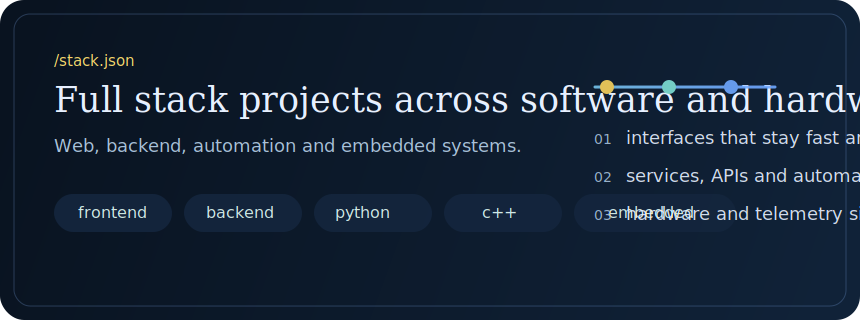
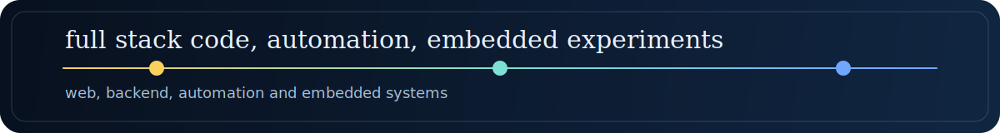

<p align="center">
  
</p>

<p align="center">
  <a href="https://github.com/kerojohan?tab=followers"></a>
  <a href="https://github.com/kerojohan?tab=repositories"></a>
  <a href="https://github.com/kerojohan/kerojohan"></a>
</p>

<table>
  <tr>
    <td width="58%" valign="top">

## Stack

- full stack development
- backend services and automation
- linux and tooling
- embedded and hardware side projects

```bash
stack = ["typescript", "python", "c++", "linux"]
build = ["web", "apis", "automation", "devices"]
```

  </td>
    <td width="42%" valign="top">
      
    </td>
  </tr>
</table>

## Tech

<p align="center">
  
  
  
  
</p>

<p align="center">
  typescript, python, linux, automation, embedded
</p>

## Featured Repos

<p align="center">
  
</p>

<p align="center">
  <a href="https://github.com/kerojohan/SpectroViewer">SpectroViewer</a> ·
  <a href="https://github.com/kerojohan/bat_tracker">bat_tracker</a> ·
  <a href="https://github.com/kerojohan/THN132N-emulator">THN132N-emulator</a> ·
  <a href="https://github.com/kerojohan/ESP32-fake-sensors-garmin">ESP32-fake-sensors-garmin</a>
</p>

<p align="center">
  
</p>
