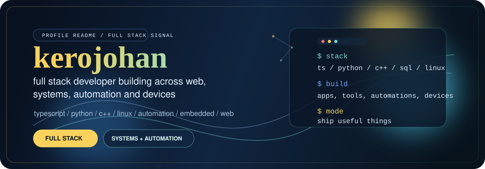

  

## Tech

  
  
  
  

  typescript, python, linux, automation, embedded

## Proyectos destacados

Esta lista se actualiza automáticamente cada día con todos mis repositorios públicos que tengan el topic `promoted`.

<!-- PROMOTED-REPOS:START -->
| Proyecto | Descripción | Tecnología |
|---|---|---|
| [bat_tracker](https://github.com/kerojohan/bat_tracker) | Bat Tracker es una herramienta de análisis de vídeo orientada a la detección y seguimiento de murciélagos. Permite identificar automáticamente individuos en escena y seguir su movimiento a lo largo del tiempo, generando datos estructurados para análisis posteriores. | Python |
| [energia-xxi-home-assistant](https://github.com/kerojohan/energia-xxi-home-assistant) | Integración no oficial de Energía XXI para Home Assistant: importa consumos eléctricos diarios y facturas recientes con estadísticas históricas y actualización automática. | Python |
| [ESP32-2432S028-esphome-projects](https://github.com/kerojohan/ESP32-2432S028-esphome-projects) | Este proyecto implementa un sistema de visualización en tiempo real para monitorear precios de electricidad y consumos energéticos utilizando un ESP32 con pantalla TFT ILI9342. | — |
| [THN132N-emulator](https://github.com/kerojohan/THN132N-emulator) | Universal emulator for Oregon Scientific THN132N (433 MHz) with reverse-engineered protocol and checksum generation. | Python |
| [ZontesZoom](https://github.com/kerojohan/ZontesZoom) | Aplicación Android para alternar rápidamente entre el DPI original y un DPI de zoom configurable, con acceso desde la app y los ajustes rápidos, sin PC después de conceder el permiso inicial por ADB. | Java |
<!-- PROMOTED-REPOS:END -->
